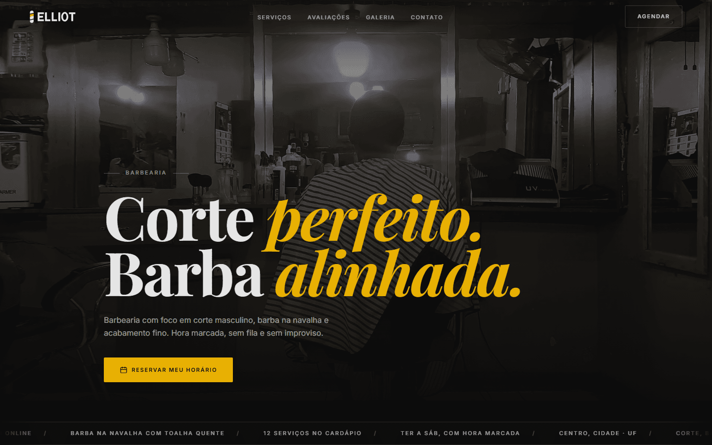
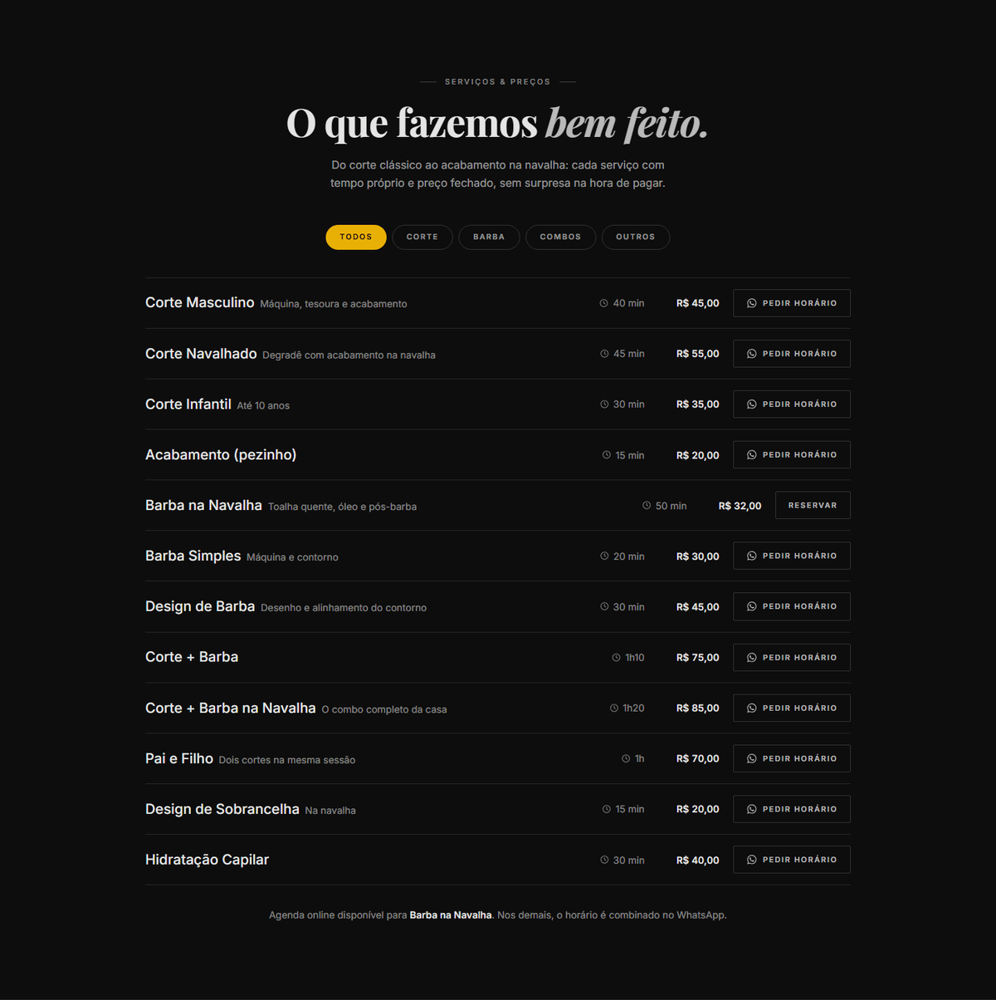
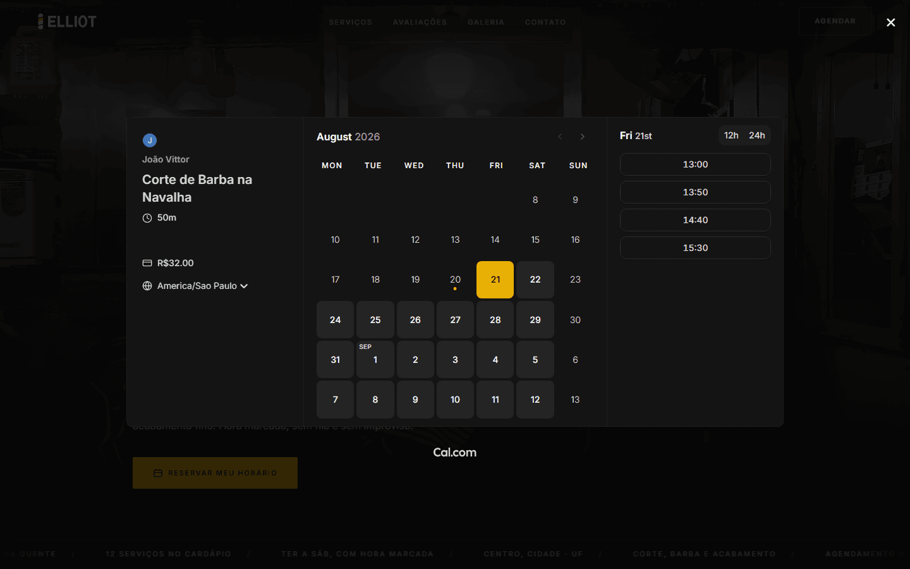
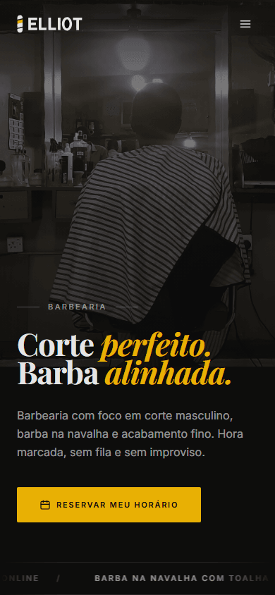
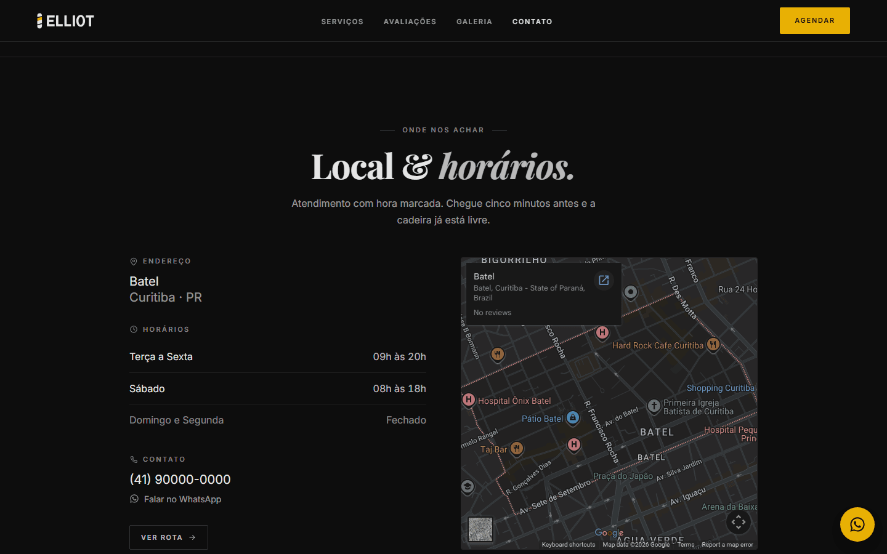

# Barbearia Elliot

Landing page de página única para uma barbearia. O site inteiro trabalha para uma coisa só: levar o visitante ao agendamento.

> ⚠️ **TODO: adicionar link do deploy (Vercel).** Este é o item mais importante do README.



| Lista de serviços | Agendamento real |
|---|---|
|  |  |

O layout do celular foi desenhado, não encolhido: o Figma de referência só tinha desktop. A hero troca a foto de paisagem por uma versão retrato, e a linha de serviço empilha em vez de espremer o nome.




## Stack

- **Vite 8** com build via Rolldown
- **React 19** e **TypeScript**
- **Tailwind CSS v4** pelo plugin do Vite, sem PostCSS e sem `tailwind.config.js`. Os tokens ficam no bloco `@theme` de `src/index.css`
- **Motion** para reveals no scroll, hover e entrada da hero
- **Lenis** para scroll suave com inércia
- **`@calcom/embed-react`** para o agendamento

São cinco dependências de produção. React e React DOM contam duas; as outras três resolvem um problema cada, e nenhuma entra no carregamento inicial: Lenis é importado quando o browser fica ocioso, o Cal só na primeira interação da pessoa com a página.

## Como rodar

```bash
npm install
npm run dev
npm run build
```

Existe um quarto script. `npm run imagens` baixa, corta e converte as fotos para WebP, e gera as variantes menores da galeria automaticamente. Ele é o caminho para trocar os placeholders pelas fotos reais sem abrir editor de imagem.

## Decisões técnicas

### A foto da hero mora no HTML, fora do React

Renderizar a imagem no componente parecia óbvio, e custava caro. O LCP no celular era 4,1s, e 82% disso era Render Delay: a foto só pintava depois do browser baixar e executar o bundle. Movi a `<picture>` para dentro do `index.html`, fora do `#root`, e deixei o estilo em `src/index.css`. O LCP caiu para 2,1s. É a única parte visual que não é componente, e o comentário está nos dois arquivos para ninguém "arrumar" isso depois.

### O Cal.com só carrega quando alguém demonstra intenção de agendar

A instalação padrão chama `getCalApi()` no mount. Esse `embed.js` é script de terceiro, roda na main thread e grava um cookie do Cloudflare deles. Ele sozinho derrubava Best Practices para 78 e o TBT no desktop para 300ms, para todo visitante, inclusive quem nunca ia agendar. Hoje ele entra na primeira interação qualquer com a página (scroll, mouse, tecla ou toque) e já prerenderiza o modal escondido. Best Practices voltou para 100, o TBT desktop para 30ms, e o modal abre instantâneo porque o iframe já está montado.

### LazyMotion em vez do Motion completo

Trocar `motion.div` por `m.div` sob um `LazyMotion` com o pacote `domAnimation` tirou 18 KB gzip do bundle (de 116 para 98). O custo é real e assumido: `domAnimation` não tem animação de layout, então a prop `layout` saiu da lista de serviços. A animação de entrada e saída que já existia cobre a troca de filtro sem ela.

### Sem GSAP

A hero é reveal com stagger, não uma timeline coreografada. Motion resolve isso, economiza uns 50 KB, e evita o trabalho de amarrar o ScrollTrigger ao mesmo raf loop do Lenis. Se a hero um dia virar uma sequência com timing preciso entre vários elementos, a conta muda.

### Um arquivo de conteúdo, e o SEO sai dele no build

Todo texto, preço, horário e endereço vive em `src/dados/conteudo.ts`. As meta tags, o Open Graph e o JSON-LD poderiam ser escritos direto no `index.html`, o que criaria a segunda cópia do endereço: na primeira vez que a barbearia mudasse de horário, o site diria uma coisa e o Google leria outra. Um plugin `transformIndexHtml` no `vite.config.ts` importa `src/dados/seo.ts` e injeta tudo durante o build. Custo em runtime: zero.

O `robots.txt` e o `sitemap.xml` saem do mesmo lugar, pelo mesmo motivo. Eles precisam da URL absoluta do site, que só existe depois do primeiro deploy, então ela é resolvida no build: `SITE_URL` se houver domínio próprio, senão a URL de produção que a Vercel injeta sozinha, senão o `localhost` do dev. Seis lugares dependem dessa URL, entre canonical, `og:image` e o `<loc>` do sitemap. Chumbada no código, ela sobe errada e o preview do link quebra justamente onde o site está sendo divulgado.

### O mapa fica visível, mas só carrega perto da dobra

Cheguei a construir uma fachada de clique aqui: um placeholder que só montava o iframe do Google depois que a pessoa clicasse. Fui conferir a medição e descobri que estava resolvendo um problema que não existia. A seção de contato fica bem abaixo da dobra, então com `loading="lazy"` o embed nunca é buscado durante a auditoria do Lighthouse, e os cookies de terceiro que eu atribuía ao mapa vinham na verdade do Cal.com. Desfiz a fachada. O mapa aparece, o peso do Google continua fora do carregamento inicial, e Best Practices seguiu em 100.



O embed do Google só existe em tema claro, e um retângulo branco no meio de uma página preta quebraria a paleta. O mapa é escurecido por filtro (`invert`, com `hue-rotate` para a água não ficar laranja) e volta ao normal no hover, para quem precisar realmente ler o mapa.

### Doze serviços, uma agenda online, nenhum botão morto

Só "Barba na Navalha" tem agenda real no Cal.com. Os outros onze não vão ganhar um link inventado, porque agenda que não existe apresentada como se existisse é conteúdo falso. Mas eles também não podem ficar sem destino: o botão deles abre o WhatsApp com o serviço já escrito na mensagem, e o rótulo diz "Pedir horário" em vez de "Reservar", com o ícone do app. A pessoa sabe para onde vai antes de clicar, e o `TipoAgendamento` em `src/tipos.ts` nem oferece mais a variante sem destino.

Duas regras atravessam o projeto inteiro. Nada inventado é apresentado como real, então os depoimentos assinam "Cliente 01" a "Cliente 06" e o JSON-LD não tem `aggregateRating`. E a paleta é 60-30-10 medido, com um inventário no topo de `src/index.css` listando os dez lugares onde o dourado pode aparecer. Dourado fora da lista é bug, não escolha.

As decisões que este README resume estão inteiras em [DECISOES.md](DECISOES.md), com o motivo de cada uma, e o que deu errado no caminho está datado em [BRAIN/brain.md](BRAIN/brain.md).

## Estrutura

```text
index.html                   loader de abertura (CSS embutido) + fundo da hero
vite.config.ts               React, Tailwind, SEO no HTML e robots/sitemap gerados
scripts/preparar-imagens.mjs corta, redimensiona e converte as fotos para WebP

src/
  main.tsx                   monta o React e dispara a saída do loader
  App.tsx                    LazyMotion, ordem das seções, hooks globais
  index.css                  tokens @theme, camadas, fundo da hero, print
  tipos.ts                   formato dos dados, sem conteúdo dentro

  dados/
    conteudo.ts              ARQUIVO ÚNICO DE CONTEÚDO. Trocar dado real é aqui
    seo.ts                   monta meta tags e JSON-LD a partir de conteudo.ts

  lib/
    cal.ts                   baixa, tematiza e abre o Cal.com sob demanda
    carregando.ts            tira o loader quando a página está pronta

  hooks/
    useLenis.ts              scroll suave e âncoras que param na altura certa
    useCalCom.ts             dispara o prerender na primeira interação
    useCarrossel.ts          galeria por IntersectionObserver, não por scrollLeft

  componentes/
    Hero, Servicos, Avaliacoes, Galeria, ContatoLocal, Rodape
    Cabecalho, Marquee, TituloSecao        estrutura recorrente
    BotaoAgendar, BotaoWhatsApp, Imagem    primitivos
    Revelar, Icones, Logo
```

## Resultado

Lighthouse no build de produção via `npm run preview`, em `127.0.0.1`. Mediana de cinco rodadas no mobile e três no desktop:

| | Performance | Acessibilidade | Best Practices | SEO |
|---|---|---|---|---|
| Desktop | **100** | 100 | 100 | 100 |
| Mobile | **93** | 100 | 100 | 100 |

Métricas de carregamento, da rodada mediana de cada plataforma:

| | FCP | LCP | TBT | CLS |
|---|---|---|---|---|
| Desktop | 0,4s | 0,6s | 20ms | 0,035 |
| Mobile | 1,4s | 2,1s | 250ms | 0,012 |

Bundle, medido arquivo por arquivo com `gzip -9`:

| | Bruto | Gzip |
|---|---|---|
| `index.html` | 17,8 KB | 5,4 KB |
| CSS | 31,0 KB | 6,8 KB |
| JS principal | 304,9 KB | 97,0 KB |
| **Caminho crítico** | **353,8 KB** | **109,2 KB** |
| Lenis (carrega ocioso) | 18,6 KB | 5,4 KB |
| Cal.com (sob demanda) | 0,8 KB | 0,5 KB |

Os dois últimos ficam de fora do caminho crítico de propósito. Nenhum dos dois é necessário para a primeira pintura.

## Desafios e o que aprendeu

**Um efeito visual custou 37 pontos de Lighthouse.** O loader de abertura tem 24 setas, e o CSS original que recebi punha `filter: drop-shadow()` em cada uma. Cada seta virava um desfoque próprio a cada quadro, no exato instante em que o browser interpretava 300 KB de bundle numa CPU quatro vezes mais lenta. O TBT foi de 200ms para 2780ms e a nota mobile de 98 para 61. Movi o filtro para o contêiner: um desfoque em vez de 24. O halo ficou visualmente idêntico, porque as setas são vizinhas e o brilho delas já se somava. A nota voltou para 92. Aprendi a olhar filtro como custo por elemento, não como propriedade decorativa.

**A pior regressão que investiguei não existia.** Depois de subir o preview com `--host` para testar no celular, a nota mobile caiu de 96 para 83 e a desktop de 100 para 73, de forma consistente em várias rodadas. Antes de mexer no código fui ver o `network-requests`: o documento tinha ido de 28ms para 305ms, enquanto bootup e main thread tinham *melhorado*. Um `curl` direto respondia em 14ms. Era o Chrome tentando `::1` antes de cair para IPv4 ao resolver `localhost`, somando uns 300ms fixos. Medindo em `127.0.0.1` a nota voltou. A lição ficou: quando a piora está inteira no Load Delay e o JS ficou mais rápido, o problema não é o seu código, e sair refatorando teria queimado horas.

**Botão que não faz nada é pior do que botão nenhum.** Onze dos doze serviços tinham um "Reservar" sem destino: um `<button>` com `onClick` undefined. Só que o `whileHover` e o `whileTap` do Motion continuavam ligados, então ele levantava com o mouse e afundava no clique. A animação prometia uma resposta que não vinha, e quem testasse concluiria que o site está quebrado, não que aquele serviço não tem agenda. A correção não foi tirar a animação: foi dar destino real ao botão. Ele abre o WhatsApp com o nome do serviço já digitado, e o `TipoAgendamento` perdeu a variante sem destino, para o erro não poder voltar por descuido. A lição é que affordance é uma promessa: se o elemento reage ao ponteiro, ele assumiu um compromisso.

**Terceiro que você não controla se resolve por timing, não por remoção.** O `embed.js` do Cal era sozinho a causa de dois problemas diferentes: main thread bloqueada e cookie de terceiro na auditoria. A saída fácil seria tirar o agendamento, que é justamente a razão do site existir. Em vez disso troquei o momento em que ele entra e a forma de abrir o modal, de atributos `data-cal-*` para chamada de função com a promessa memorizada, para que um clique antes do download terminar não se perca. O recurso continuou inteiro e as duas auditorias foram para 100.

## Pendências

Os dados da barbearia são placeholder e estão marcados em `src/dados/conteudo.ts`: horários, depoimentos e onze dos doze serviços. O telefone e o WhatsApp são fictícios, com DDD de Curitiba e zeros no final, e saem de uma constante só (`whatsappNumero`). O link abre o app normalmente; é o número que não existe, então o WhatsApp responde que ele é inválido.

A localização é divulgada no nível de bairro (Batel, Curitiba), sem rua nem número. Endereço de porta inventado é o tipo de dado falso que engana de verdade, então `rua` e `cep` são campos opcionais no tipo e ficam vazios até existir endereço confirmado. O componente e o JSON-LD já omitem os dois quando não existem.

A exceção é "Barba na Navalha", que aponta para uma agenda real no Cal.com e funciona de ponta a ponta, incluindo confirmação por e-mail. Os valores dessa linha (50 min, R$32) vêm do evento real, não são inventados.

As fotos em `public/imagens/` também são provisórias. `public/imagens/LEIA-ME.md` diz o que cada arquivo deve virar e como trocar.

## Créditos

Tipografia: Inter e Playfair Display, via Google Fonts.
Fotos placeholder: série "Barbershop Ritual" de Alvinategyeka, CC0, no Wikimedia Commons.

Código sob [licença de visualização](LICENSE): leitura e análise liberadas, cópia e redistribuição não.
